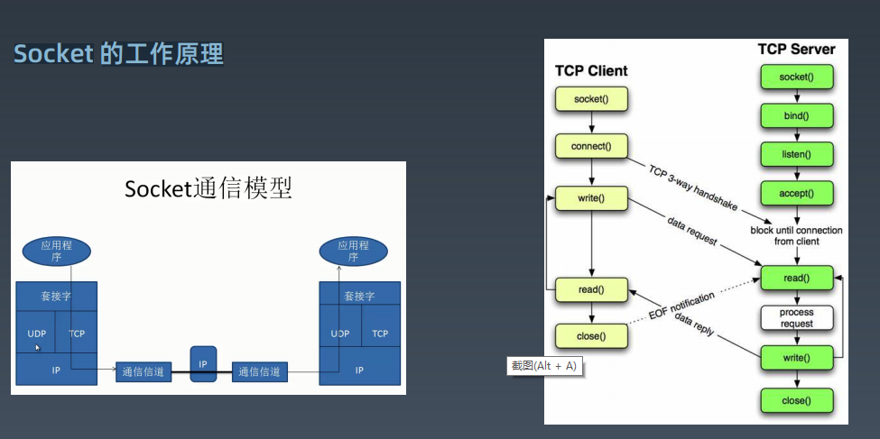
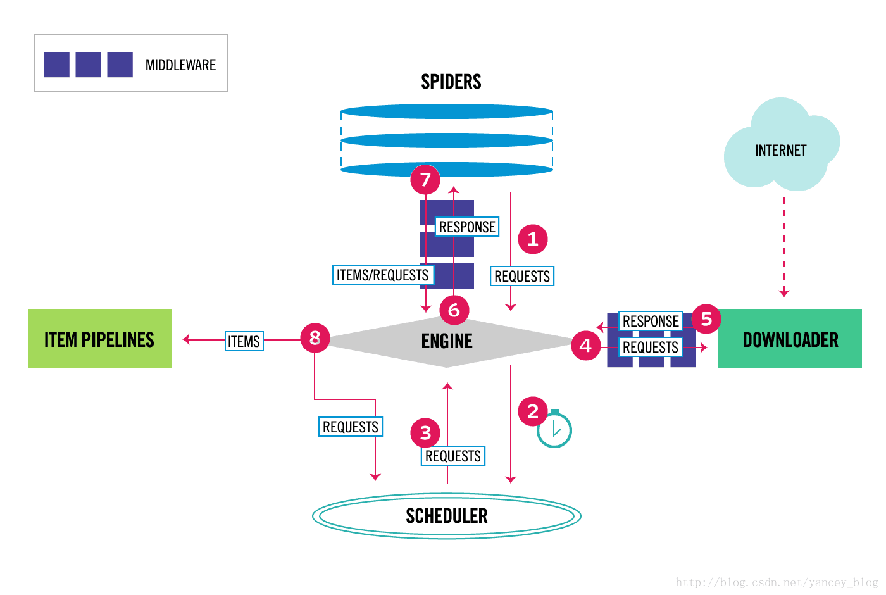

# 学习笔记(第二周-HTTP)

## 网络协议-模型

OSI参考模型

1. 物理层
2. 数据链路层
3. 网络层
4. 传输层
5. 会话层
6. 表示层
7. 应用层

TCP/IP模型

1. 网络接口层
2. 网络层
3. 传输层
4. 应用层



socket的api

1. socket()
2. bind()
3. listen()
4. accept()
5. recv()：接收数据-与网卡交互
6. send():发送数据-与网卡交互
7. close()

## socket编程实践

http请求样例

```python
import requests
##pip install requests
r = requests.get('https://www.baidu.com')
print(r.status_code)
print(r.headers)
##print(r.text)
```

使用socket编写客户端的样例

```python
#!/usr/bin/env python
import socket
#AF_INET是IPV4,SOCK_STREAM 是TCP
##创建socket对象
s = socket.socket(socket.AF_INET,socket.SOCK_STREAM)
print(f's1:{s}')
##与远程建立TCP链接
s.connect(('www.baidu.com',80))
print(f's2:{s}')
##发送http协议请求头
s.send(b'GET / HTTP/1.1\r\nHOST:www.baidu.com\r\nConnection: close\n\r\n')
##接收返回内容
buffer = []
while True:
    data = s.recv(1024)
    if data:
        buffer.append(data)
    else:
        break
s.close()
response = b''.join(buffer)
header,html = response.split(b'\r\n\r\n',1)
print(header.decode('utf-8'))
with open('index.html','wb') as f:
    f.write(html)
```

echo服务client

```python
#!/usr/bin/env python
import socket

##定义要链接的主机和端口
HOST = 'localhost'
PORT = 10008

def echo_client():
    #AF_INET是IPV4,SOCK_STREAM 是TCP
    ##创建socket对象
    s = socket.socket(socket.AF_INET,socket.SOCK_STREAM)
    print(f's1:{s}')
    ##与远程建立TCP链接
    s.connect((HOST,PORT))
    print(f's2:{s}')
    while True:
        ##接收用户输入
        data = input('input > ')
        if data == 'exit':
            break        
        ##发送数据到服务端
        s.sendall(data.encode())
        ##接收服务器数据
        data = s.recv(1024)
        if not data:
            break
        else:
            print(data.decode('utf-8'))
    s.close()

if __name__ == '__main__':
    echo_client()
```

echo 服务server

```python
#!/usr/bin/env python
import socket

##定义要链接的主机和端口
HOST = 'localhost'
PORT = 10008

def echo_server():
    #AF_INET是IPV4,SOCK_STREAM 是TCP
    ##创建socket对象
    s = socket.socket(socket.AF_INET,socket.SOCK_STREAM)
    print(f's1:{s}')
    ##将socket对象与端口进行绑定
    s.bind((HOST,PORT))
    ##只接受1个链接
    s.listen(1)
    print(f's2:{s}')
    while True:
        ##接收用户的远程链接
        conn, addr = s.accept()
        ##输出客户端地址
        print(f'connnet by {addr}')
        while True:
            data = conn.recv(1024)
            if not data:
                break
            conn.sendall(data)
        conn.close()
    s.close()

if __name__ == '__main__':
    echo_server()
```

## 前端基础知识

1. HTML
2. W3C
3. css
4. ajax

## HTTP协议和浏览器的关系

HTTP协议的header：用于交互控制信息，其中的要素有：

1. Request Url:请求的地址
2. status code:返回的状态码（1XX：信息响应，2XX：成功响应，3XX：重定向，4XX:客户端响应，5XX:服务端响应）
3. request Method:(get :获取信息 post:提交信息)
4. Request Headers-Cookie:(保存加密过后的验证信息)
5. User-Agent:客户端使用的是什么样的浏览器

## Requests库入门实战

爬取页面-（不含登录的场景与录入信息）

```python
import requests

user_agent = 'Mozilla/5.0 (Windows NT 10.0; Win64; x64) AppleWebKit/537.36 (KHTML, like Gecko) Chrome/87.0.4280.88 Safari/537.36'
header = {'User-Agent':user_agent}
myurl = 'https://movie.douban.com/chart'
response = requests.get(myurl,headers=header)

print(response.text)
print(f'返回码是：{response.status_code}')
```

## 异常捕获处理

异常捕获样例

```python
gennumber = ( i for i in range(0,2))
print(next(gennumber))
print(next(gennumber))
try:
    print(next(gennumber))
except StopIteration:
    print('最后一个元素')
```

所有异常都继承BaseException

常见的异常类型：

1. LookupError(IndexError、KeyError)
2. IOError:
3. NameError:
4. TypeError:
5. AttributeError:
6. ZeroDivisionError:除0错误

抛出异常使用：raise关键字

异常的定义：

```python
class UserInputException(Exception):
    def __init__(self, ErrorInfo):
        super().__init__(self, ErrorInfo)
        self.errorinfo = ErrorInfo
    def __str__(self):
        return self.errorinfo
```

异常的美化：通过import pretty_errors 完成

打开文件的写法：

```python
with open('a.txt',encoding='utf8') as file2:
    data = file2.read()
```

## 重构优化获取网页程序

```python
import requests
from pathlib import Path
import sys

user_agent = 'Mozilla/5.0 (Windows NT 10.0; Win64; x64) AppleWebKit/537.36 (KHTML, like Gecko) Chrome/87.0.4280.88 Safari/537.36'
header = {'User-Agent':user_agent}
myurl = 'https://movie.douban.com/chart'
try:
    response = requests.get(myurl,headers=header)
except requests.exceptions.ConnectTimeout as e :
    print(f"请求超时:{e}")
    sys.exit(1)
##获取脚本所在路径
p = Path(__file__)
pyfile_path = p.resolve().parent
##添加html目录用于保存网页
html_path = pyfile_path.joinpath('html')
if not html_path.is_dir():
    Path.mkdir(html_path)
##拼接页面文件路径
page = html_path.joinpath('douban.html')

##异常处理
try:
    with open(page,'w',encoding='utf-8') as f:
        f.write(response.text)
except FileNotFoundError as e:
    print(f'文件无法打开，{e}')
except IOError as e:
    print(f'文件读写出错，{e}')
except Exception as e:
    print(f'异常信息，{e}')

```

## 深入理解Http协议

```python
import requests
##get请求网址
r = requests.get('http://www.httpbin.org')
##查看请求的url
r.url
##查看请求的结果
r.text
##输入请求参数
payload = {'key1':'value1', 'key2':['value2','value3']}
r = requests.get('http://www.httpbin.org', params=payload)
##request-headers：里面的关键要素
##request-headers-Host:访问的主机名
##request-headers-Referer:从哪个页面访问过来
##request-headers-User-Agent:当前客户端的浏览器版本
```

## POST和cookies

post请求：

```python
import requests
r = requests.post('http://httpbin.org/post', data = {'key':'value'})
r.json()
```

cookies的样例：

```python
import requests
##保持cookie
with requests.Session() as s:
    s.get('http://httpbin.org/cookies/set/sessioncookie/123456789')
    r = s.get('http://httpbin.org/cookies')
    print(r.text)
```

老师编写的post样例

```python
import time
import requests
from fake_useragent import UserAgent

ua = UserAgent(verify_ssl=False)
headers = {
'User-Agent' : ua.random,
'Referer' : 'https://accounts.douban.com/passport/login_popup?login_source=anony'
}

s = requests.Session()
# 会话对象：在同一个 Session 实例发出的所有请求之间保持 cookie， 
# 期间使用 urllib3 的 connection pooling 功能。
# 向同一主机发送多个请求，底层的 TCP 连接将会被重用，从而带来显著的性能提升。
login_url = 'https://accounts.douban.com/j/mobile/login/basic'
form_data = {
'ck':'',
'name':'15055495@qq.com',
'password':'',
'remember':'false',
'ticket':''
}

# post数据前获取cookie
pre_login = 'https://accounts.douban.com/passport/login'
pre_resp = s.get(pre_login, headers=headers)

response = s.post(login_url, data=form_data, headers=headers, cookies=s.cookies)


# 登陆后可以进行后续的请求
# url2 = 'https://accounts.douban.com/passport/setting'

# response2 = s.get(url2,headers = headers)
# response3 = newsession.get(url3, headers = headers, cookies = s.cookies)

# with open('profile.html','w+') as f:
    # f.write(response2.text)

```

## 用XPATH解析网页内容

chrome浏览器使用xpath

1. 检查源代码的时候，在代码框里面右键，就可以看到copy = xpath的选项
2. 在代码页面里面，按ctrl+F 就可以出现验证xpath的输入框了

老师的代码样例

```python
# 翻页的处理
import requests
from lxml import etree
# pip install lxml
from time import sleep
# 控制请求的频率，引入了time模块

# 使用def定义函数，myurl是函数的参数
def get_url_name(myurl):
    ua = 'Mozilla/5.0 (Macintosh; Intel Mac OS X 10_15_1) AppleWebKit/537.36 (KHTML, like Gecko) Chrome/78.0.3904.108 Safari/537.36'

    header = {'user-agent':ua}
    response = requests.get(myurl,headers=header)

    selector = etree.HTML(response.text)
    # 电影名称列表
    film_name = selector.xpath('//div[@class="hd"]/a/span[1]/text()')

    # 电影链接列表
    film_link = selector.xpath('//div[@class="hd"]/a/@href')

    # 遍历对应关系字典
    film_info = dict(zip(film_name, film_link))

    for i in film_info:
        print(f'电影名称： {i} \t\t 电影链接： {film_info[i]}')

if __name__ == '__main__':
    # 生成包含所有页面的元组
    urls = tuple(f'https://movie.douban.com/top250?start={ page * 25 }&filter=' for page in range(10))

    for page in urls:
        get_url_name(page)
        sleep(5)
```

## Scrapy架构

旧版架构图


新版架构图



架构解析：

1. 引擎Engine:进行业务调度包括多线程和协程，进行各组件的调度
2. 爬虫Spiders:用于组装http信息，模拟浏览器请求
3. 调度器secheduler:用于控制请求发起的先后顺序，以及并发的控制
4. 下载器downloader：真正去发起请求，执行网页的下载
5. 管道ItemPipelines:进行对象的保存

老师的代码样例：

```python
import requests
from lxml import etree
from queue import Queue
import threading
import json


class CrawlThread(threading.Thread):
    '''
    爬虫类
    '''

    def __init__(self, thread_id, queue):
        super().__init__()
        self.thread_id = thread_id
        self.queue = queue
        self.headers = {
            'User-Agent': 'Mozilla/5.0 (Macintosh; Intel Mac OS X 10_15_4) AppleWebKit/537.36 (KHTML, like Gecko) Chrome/83.0.4103.61 Safari/537.36'
        }

    def run(self):
        # 重写run方法
        print(f'启动线程：{self.thread_id}')
        self.scheduler()
        print(f'结束线程：{self.thread_id}')

    # 模拟任务调度
    def scheduler(self):
        while not self.queue.empty():
            # 队列为空不处理
            page = self.queue.get()
            print(f'下载线程：{self.thread_id}, 下载页面：{page}')
            url = f'https://book.douban.com/top250?start={page*25}'

            try:
                # downloader 下载器
                response = requests.get(url, headers=self.headers)
                dataQueue.put(response.text)
            except Exception as e:
                print('下载出现异常', e)


class ParserThread(threading.Thread):
    '''
    页面内容分析
    '''

    def __init__(self, thread_id, queue, file):
        threading.Thread.__init__(self)      # 上面使用了super()
        self.thread_id = thread_id
        self.queue = queue
        self.file = file

    def run(self):
        print(f'启动线程：{self.thread_id}')
        while flag:                      # 这里有什么优化思路？
            try:
                item = self.queue.get(False)  # 参数为false时队列为空，抛出异常
                    if not item:                 
                    continue
                self.parse_data(item)
                self.queue.task_done()  # get之后检测是否会阻塞
            except Exception as e:
                pass
        print(f'结束线程：{self.thread_id}')

    def parse_data(self, item):
        '''
        解析网页内容的函数
        :param item:
        :return:
        '''
        try:
            html = etree.HTML(item)
            books = html.xpath('//div[@class="pl2"]')
            for book in books:
                try:
                    title = book.xpath('./a/text()')
                    link = book.xpath('./a/@href')
                    response = {
                        'title': title,
                        'link': link
                    }
                    # 解析方法和scrapy相同，再构造一个json
                    json.dump(response, fp=self.file, ensure_ascii=False)
                except Exception as e:
                    print('book error', e)

        except Exception as e:
            print('page error', e)


if __name__ == '__main__':

    # 定义存放网页的任务队列
    pageQueue = Queue(20)
    for page in range(0, 11):
        pageQueue.put(page)

    # 定义存放解析数据的任务队列
    dataQueue = Queue()


    # 爬虫线程
    crawl_threads = []
    crawl_name_list = ['crawl_1', 'crawl_2', 'crawl_3']
    for thread_id in crawl_name_list:
        thread = CrawlThread(thread_id, pageQueue)
        thread.start()
        crawl_threads.append(thread)

    # 将结果保存到一个json文件中
    with open('book.json', 'a', encoding='utf-8') as pipeline_f:

        # 解析线程
        parse_thread = []
        parser_name_list = ['parse_1', 'parse_2', 'parse_3']
        flag = True
        for thread_id in parser_name_list:
            thread = ParserThread(thread_id, dataQueue, pipeline_f)
            thread.start()
            parse_thread.append(thread)

        # 结束crawl线程
        for t in crawl_threads:
            t.join()

        # 结束parse线程
        flag = False
        for t in parse_thread:
            t.join()

    print('退出主线程')

```


# 感想与总结

问题:

1. 在IDE中运行起来的echo_server要怎么进行关闭呢？
2. 在爬虫的时候返回了418，视频中的headers的关键字要修改为User-Agent

# 作业

## socket传输文件

1. （需提交代码作业）不使用开源框架，基于 TCP 协议改造 echo 服务端和客户端代码，实现服务端和客户端可以传输单个文件的功能。

echo_client.py

```python
#!/usr/bin/env python
import socket
from pathlib import Path

##定义要链接的主机和端口
HOST = 'localhost'
PORT = 10008

def echo_client():
    #AF_INET是IPV4,SOCK_STREAM 是TCP
    ##创建socket对象
    s = socket.socket(socket.AF_INET,socket.SOCK_STREAM)
    print(f's1:{s}')
    ##与远程建立TCP链接
    s.connect((HOST,PORT))
    print(f's2:{s}')
    while True:
        ##接收用户输入
        filePath = input('input file full path > ')
        if filePath == 'exit':
            break 
        ##读取文件
        p = Path(filePath)
        if p.exists() and p.is_file():
            with open(p,'rb') as f:
                ##发送数据到服务端
                s.sendall(f.read())
        else:
            print(f'file is not exists')
    s.close()

if __name__ == '__main__':
    echo_client()

```

echo_server.py

```python
#!/usr/bin/env python
import socket
from pathlib import Path
import time
##定义要链接的主机和端口
HOST = 'localhost'
PORT = 10008

def echo_server():
    #AF_INET是IPV4,SOCK_STREAM 是TCP
    ##创建socket对象
    s = socket.socket(socket.AF_INET,socket.SOCK_STREAM)
    print(f's1:{s}')
    ##将socket对象与端口进行绑定
    s.bind((HOST,PORT))
    ##只接受1个链接
    s.listen(1)
    print(f's2:{s}')
    while True:
        ##接收用户的远程链接
        conn, addr = s.accept()
        ##输出客户端地址
        print(f'connnet by {addr}')
        ##准备写入的文件名：
        file_name = time.strftime("%Y-%m-%d-%H-%M-%S",time.localtime())
        p = Path(__file__)
        recv_file = p.resolve().parent.joinpath(file_name)
        with open(recv_file,'wb+') as f:
            while True:
                data = conn.recv(1024)
                if not data:                    
                    break
                f.write(data)
        conn.close()
    s.close()

if __name__ == '__main__':
    echo_server()
```

## 知乎爬虫

mod2_miniScrapy.py

```python
import requests
from lxml import etree
from queue import Queue
import threading
import json


class CrawlThread(threading.Thread):
    '''
    爬虫类
    '''

    def __init__(self, thread_id, queue):
        super().__init__()
        self.thread_id = thread_id
        self.queue = queue
        self.headers = {
            'User-Agent': 'Mozilla/5.0 (Windows NT 10.0; Win64; x64) AppleWebKit/537.36 (KHTML, like Gecko) Chrome/87.0.4280.88 Safari/537.36',
            'referer':'https://www.zhihu.com/question/50160122',
            'cookie' :'_zap=bdb31c07-aa0d-4d78-a776-3a8fb483c128; d_c0="AJDiKy5o7g-PTvE7OO_fhrvHERcr8ipiz0I=|1566477257"; _xsrf=bVh4EowtAKuNswVUpCAHlLoPHuJlQvIv; q_c1=e1fb18e1d3d04551b169bf9b4e47ddfb|1579708032000|1566990013000; _ga=GA1.2.1127958217.1585618878; SESSIONID=es5J9WWADvyLS39JD4TwSyr4yELRVsS6r4jQfdXQcx7; JOID=UFocA0qLPcfxP-dXZ4mOVEM-57Z97kX7ugWwCy_MS7W0bdduJrqqP6w87FVv3LMi8ihBbkmZN2vbZBAs1ggpXRw=; osd=UlkTAUuJPsjzPuVUaIuPVkAx5bd_7Ur5uwezBC3NSba7b9ZsJbWoPq4_41du3rAt8ClDbUabNmnYaxIt1AsmXx0=; Hm_lvt_98beee57fd2ef70ccdd5ca52b9740c49=1607263023,1607263093,1609602361,1609602440; capsion_ticket="2|1:0|10:1609602447|14:capsion_ticket|44:OTExNGM5OTA2YzBkNGQ2ZmE2YjhiZGVlMTJhYjg1NTI=|68e096aa4662e911baf5f147d6e9cb6d68952312d36e1b6682c56e755978639f"; Hm_lpvt_98beee57fd2ef70ccdd5ca52b9740c49=1609643600; KLBRSID=2177cbf908056c6654e972f5ddc96dc2|1609643624|1609643211'
        }

    def run(self):
        # 重写run方法
        print(f'启动线程：{self.thread_id}')
        self.scheduler()
        print(f'结束线程：{self.thread_id}')

    # 模拟任务调度
    def scheduler(self):
        while not self.queue.empty():
            # 队列为空不处理
            page = self.queue.get()
            print(f'下载线程：{self.thread_id}, 下载页面：{page}')
            url = f'https://www.zhihu.com/question/50160122'

            try:
                # downloader 下载器
                print(f'下载线程：{self.thread_id},链接知乎开始')
                response = requests.get(url, headers=self.headers)
                print(f'下载线程：{self.thread_id},获取信息完成')
                dataQueue.put(response.text)
            except Exception as e:
                print('下载出现异常', e)


class ParserThread(threading.Thread):
    '''
    页面内容分析
    '''

    def __init__(self, thread_id, queue, file):
        threading.Thread.__init__(self)      # 上面使用了super()
        self.thread_id = thread_id
        self.queue = queue
        self.file = file

    def run(self):
        print(f'启动线程：{self.thread_id}')
        while flag:                      # 这里有什么优化思路？
            try:
                item = self.queue.get(False)  # 参数为false时队列为空，抛出异常
                if not item:                 
                    continue
                self.parse_data(item)
                self.queue.task_done()  # get之后检测是否会阻塞
            except Exception as e:
                pass
        print(f'结束线程：{self.thread_id}')

    def parse_data(self, item):
        '''
        解析网页内容的函数
        :param item:
        :return:
        '''
        try:
            html = etree.HTML(item)
            books = html.xpath('//div[@class="List-item"]')
            for book in books:
                try:
                    title = book.xpath('./div[@class="ContentItem AnswerItem"]/@data-zop')
                    answer = book.xpath('.//span[@class="RichText ztext CopyrightRichText-richText"]//text()')
                    response = {
                        'title': title,
                        'answer': answer
                    }
                    # 解析方法和scrapy相同，再构造一个json
                    json.dump(response, fp=self.file, ensure_ascii=False)
                except Exception as e:
                    print('book error', e)

        except Exception as e:
            print('page error', e)


if __name__ == '__main__':

    # 定义存放网页的任务队列
    pageQueue = Queue(1)
    for page in range(0, 1):
        pageQueue.put(page)

    # 定义存放解析数据的任务队列
    dataQueue = Queue()


    # 爬虫线程
    crawl_threads = []
    crawl_name_list = ['crawl_1']
    for thread_id in crawl_name_list:
        thread = CrawlThread(thread_id, pageQueue)
        thread.start()
        crawl_threads.append(thread)

    # 将结果保存到一个json文件中
    with open('book.json', 'a', encoding='utf-8') as pipeline_f:

        # 解析线程
        parse_thread = []
        parser_name_list = ['parse_1']
        flag = True
        for thread_id in parser_name_list:
            thread = ParserThread(thread_id, dataQueue, pipeline_f)
            thread.start()
            parse_thread.append(thread)

        # 结束crawl线程
        for t in crawl_threads:
            t.join()

        # 结束parse线程
        flag = False
        for t in parse_thread:
            t.join()

    print('退出主线程')

```

