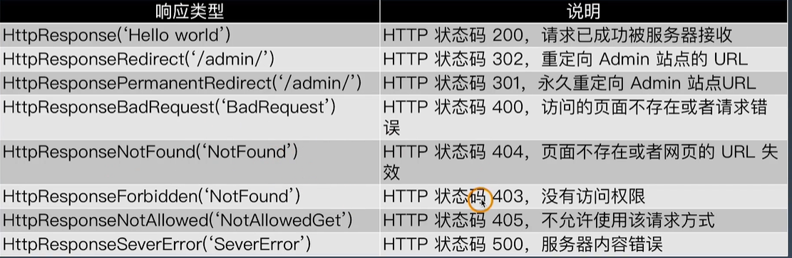

# 学习笔记(第四周Django)

## Django的安装

```shell
##建议安装2.2.13的稳定版本
pip install django==2.2.13
##低版本升级到2.2.13
pip install --upgrade django==2.2.13
```

## 创建Django项目

```shell
##创建项目
django-admin startproject MyDjango
##manage.py 命令工具
##MyDjango/settings.py 配置信息
##查看命令工具帮助
python manage.py help
##创建应用程序
python manage.py startapp index
##启动应用程序
python manage.py runserver
##使用ctrl+C进行终止
##选择启动端口,下面命令样例为80
python manage.py runserver 0.0.0.0:80
```

应用程序文件介绍

| 文件             | 描述             |
| ---------------- | ---------------- |
| index/migrations | 数据库迁移文件夹 |
| index/models.py  | 模型             |
| index/apps.py    | 当前app配置文件  |
| index/admin.py   | 管理后台         |
| index/tests.py   | 自动化测试       |
| index/views.py   | 视图             |

## Django配置文件解析

```python
"""
Django settings for MyDjango project.

Generated by 'django-admin startproject' using Django 2.2.13.

For more information on this file, see
https://docs.djangoproject.com/en/2.2/topics/settings/

For the full list of settings and their values, see
https://docs.djangoproject.com/en/2.2/ref/settings/
"""

import os

#### 项目路径
# Build paths inside the project like this: os.path.join(BASE_DIR, ...)
BASE_DIR = os.path.dirname(os.path.dirname(os.path.abspath(__file__)))

#### 密钥
# Quick-start development settings - unsuitable for production
# See https://docs.djangoproject.com/en/2.2/howto/deployment/checklist/

# SECURITY WARNING: keep the secret key used in production secret!
SECRET_KEY = 'p*d7^ue2xmk+1d(5!jk_1^lk2r1jf%!+@)k3!)hjo3(c%mygsu'

#### 调试模式
# SECURITY WARNING: don't run with debug turned on in production!
DEBUG = True

#### 域名访问权限
ALLOWED_HOSTS = []

#### App列表
# Application definition

INSTALLED_APPS = [
    ####  内置的后台管理系统
    'django.contrib.admin',
    ####  内置的用户认证系统
    'django.contrib.auth',
    #### 所有model元数据
    'django.contrib.contenttypes',
    #### 会话，表示当前访问网站的用户身份
    'django.contrib.sessions',
    #### 消息提示
    'django.contrib.messages',
    #### 静态资源路径
    'django.contrib.staticfiles',
    #### 注册自己的APP
    'index',
]
#### 中间件是request和response对象之间的钩子
MIDDLEWARE = [
    'django.middleware.security.SecurityMiddleware',
    'django.contrib.sessions.middleware.SessionMiddleware',
    'django.middleware.common.CommonMiddleware',
    'django.middleware.csrf.CsrfViewMiddleware',
    'django.contrib.auth.middleware.AuthenticationMiddleware',
    'django.contrib.messages.middleware.MessageMiddleware',
    'django.middleware.clickjacking.XFrameOptionsMiddleware',
]

ROOT_URLCONF = 'MyDjango.urls'

TEMPLATES = [
    {
        #### 定义模板引擎
        'BACKEND': 'django.template.backends.django.DjangoTemplates',
        #### 设置模板路径
        'DIRS': [],
        #### 是否在App里查找模板文件
        'APP_DIRS': True,
        #### 用于RequestContext上下文的调用函数
        'OPTIONS': {
            'context_processors': [
                'django.template.context_processors.debug',
                'django.template.context_processors.request',
                'django.contrib.auth.context_processors.auth',
                'django.contrib.messages.context_processors.messages',
            ],
        },
    },
]

WSGI_APPLICATION = 'MyDjango.wsgi.application'


# Database
# https://docs.djangoproject.com/en/2.2/ref/settings/#databases
#### 数据库配置，默认是sqlite，Django2.2使用mysqlclient或pymysql模块连接MySQL
# DATABASES = {
#     'default': {
#         'ENGINE': 'django.db.backends.sqlite3',
#         'NAME': os.path.join(BASE_DIR, 'db.sqlite3'),
#     }
# }

# export PATH=$PATH:/usr/local/mysql/bin
# OSError: mysql_config not found
# pip install mysqlclient
# pip install pymysql
DATABASES = {
    'default': {
        'ENGINE': 'django.db.backends.mysql',
        'NAME': 'test',
        'USER': 'root',
        'PASSWORD': 'rootroot',
        'HOST': '127.0.0.1',
        'PORT': '3306',
    }
    # 生产环境有可能连接第二个数据库
    # 'db2': {
    #     'ENGINE': 'django.db.backends.mysql',
    #     'NAME': 'mydatabase',
    #     'USER': 'mydatabaseuser',
    #     'PASSWORD': 'mypassword',
    #     'HOST': '127.0.0.1',
    #     'PORT': '3307',
    # }
}


# Password validation
# https://docs.djangoproject.com/en/2.2/ref/settings/#auth-password-validators

AUTH_PASSWORD_VALIDATORS = [
    {
        'NAME': 'django.contrib.auth.password_validation.UserAttributeSimilarityValidator',
    },
    {
        'NAME': 'django.contrib.auth.password_validation.MinimumLengthValidator',
    },
    {
        'NAME': 'django.contrib.auth.password_validation.CommonPasswordValidator',
    },
    {
        'NAME': 'django.contrib.auth.password_validation.NumericPasswordValidator',
    },
]


# Internationalization
# https://docs.djangoproject.com/en/2.2/topics/i18n/
##设置为中文zh-CN*(报错)--》zh-Hans
LANGUAGE_CODE = 'en-us'
##Asia/Shanghai 修改时间
TIME_ZONE = 'UTC'

USE_I18N = True

USE_L10N = True

USE_TZ = True


# Static files (CSS, JavaScript, Images)
# https://docs.djangoproject.com/en/2.2/howto/static-files/

STATIC_URL = '/static/'

```

## URL调度器

配置文件在urls.py中

可以通过 path(‘${匹配路径}’,include(''index.urls))去包含其他配置文件

带变量的url

| str  |      |
| ---- | ---- |
| int  |      |
| slug |      |
| uuid |      |
| path |      |

path('<int:year>',views.myyear),

url样例：

```python
    path('', views.index),

    ### 带变量的URL
    # path('<int:year>', views.year),  # 只接收整数，其他类型返回404
    path('<int:year>/<str:name>', views.name),

    ### 正则匹配
    re_path('(?P<year>[0-9]{4}).html', views.myyear, name='urlyear'),

    ### 自定义过滤器
    path('<yyyy:year>', views.year), 
```

对应的处理类：

```python
from django.shortcuts import render
from django.shortcuts import redirect

# Create your views here.
from django.http import HttpResponse

def index(request):
    return HttpResponse("Hello Django!")

# path('<int:year>', views.year), 
def year(request, year):
    # return HttpResponse(year)
    return redirect('/2020.html')

# path('<int:year>/<str:name>', views.name),
def name(request, **kwargs):
    return HttpResponse(kwargs['name'])

# path('<myint:year>', views.year), 
# re_path('(?P<year>[0-9]{4}).html', views.myyear, name='urlyear'),
def myyear(request, year):
    return render(request, 'yearview.html')

```

自定义url类型

```python
##在urls中引入
register_converter(converters.IntConverter,'myint')
register_converter(converters.FourDigitYearConverter, 'yyyy')
```

新建：converters.py文件

```python
class IntConverter:
    regex = '[0-9]+'

    def to_python(self, value):
        return int(value)

    def to_url(self, value):
        return str(value)

class FourDigitYearConverter:
    regex = '[0-9]{4}'

    def to_python(self, value):
        return int(value)

    def to_url(self, value):
        return '%04d' % value
```

## view视图

快捷函数

| 函数                | 功能                                     |
| ------------------- | ---------------------------------------- |
| render()            | 模板与上下文结合，返回httpRespons        |
| redirect()          | 重定向                                   |
| get_object_or_404() | 调用get，不存在的话不是报错，而是返回404 |

django的响应类型



## 使用ORM创建数据库表

```python
##model的样例
from django.db import models

# Create your models here.
# 图书or电影
class Type(models.Model):
    # id = models.AutoField(primary_key=True)  # Django会自动创建,并设置为主键
    typename = models.CharField(max_length=20)

# 作品名称和作者(主演)
class Name(models.Model):
    # id 自动创建
    name = models.CharField(max_length=50)
    author = models.CharField(max_length=50)
    stars = models.CharField(max_length=10)

##给实体class添加功能,生成中间脚本
python manage.py makemigrations
##根据中间脚本生成表
python manage.py migrate
```

**需要注意的是替换Mysql客户端**

修改项目的\__init__.py文件

```python
# pip install pymysql

import pymysql
pymysql.install_as_MySQLdb()
```

错误处理：

```python
##AttributeError: 'str' object has no attribute 'decode'
##注释下面语句
##        if query is not None:
##            query = query.decode(errors='replace')
```

[官方文档](https://docs.djangoproject.com/zh-hans/2.2/)

通过ORM-API进行操作的样例

```shell
数据表的读写
$ python manage.py  shell
>>> from index.models import *
>>> n = Name()
>>> n.name='红楼梦'
>>> n.author='曹雪芹'
>>> n.stars=9.6
>>> n.save()

使用ORM框架api实现
增
>>> from index.models import *
>>> Name.objects.create(name='红楼梦', author='曹雪芹', stars='9.6')
>>> Name.objects.create(name='活着', author='余华', stars='9.4')


查
>>> Name.objects.get(id=2).name

改
>>> Name.objects.filter(name='红楼梦').update(name='石头记')

删 
单条数据
>>> Name.objects.filter(name='红楼梦').delete()
全部数据
>>> Name.objects.all().delete()

其他常用查询
>>> Name.objects.create(name='红楼梦', author='曹雪芹', stars='9.6')
>>> Name.objects.create(name='活着', author='余华', stars='9.4')
>>> Name.objects.all()[0].name
>>> n = Name.objects.all()
>>> n[0].name
>>> n[1].name

>>> Name.objects.values_list('name')
<QuerySet [('红楼梦',), ('活着',)]>
>>> Name.objects.values_list('name')[0]
('红楼梦’,)
filter支持更多查询条件
filter(name=xxx, id=yyy)

可以引入python的函数
>>> Name.objects.values_list('name').count()
2

```

## 反向生成model

```shell
##反向生成命令
python manage.py inspectdb > models.py
```


## template

界面展示的样例

```python
from django.shortcuts import render
from django.shortcuts import redirect

# Create your views here.
from django.http import HttpResponse

###  从models取数据传给template  ###
from .models import Name

def index(request):
    return HttpResponse("Hello Django!")

def myyear(request, year):
    return render(request, 'yearview.html')

def year(request, year):
    return HttpResponse(year)
    # return redirect('/2020.html')

def name(request, **kwargs):
    return HttpResponse(kwargs['name'])

def books(request):
    ###  从models取数据传给template  ###
    n = Name.objects.all()
    return render(request, 'bookslist.html', locals())
```

urls

```python
from django.urls import path, re_path, register_converter
from . import views, converters

register_converter(converters.IntConverter,'myint')
register_converter(converters.FourDigitYearConverter, 'yyyy')

urlpatterns = [
    path('', views.index),
    re_path('(?P<year>[0-9]{4}).html', views.myyear, name='urlyear'),
    ### 带变量的URL
    path('<int:year>', views.year),  # 只接收整数，其他类型返回404
    path('<int:year>/<str:name>', views.name),
    # path('<myint:year>', views.year), # 自定义过滤器
    path('books', views.books),

]
```

```html
##booklist.html
<html>
<head>
    <meta charset="UTF-8">
    <title>BooksList</title>
</head>
<body>


    <div>bookname: {{ book.name }}   <br>
           author: {{ book.author }} <br>
           stars:  {{ book.stars }}  
    </div>

</body>

##header.html
<html>
<head>
    <meta charset="UTF-8">
    <title>{{ title }}</title>
</head>
</html>

##yearview.html
<html>
<head>
    <meta charset="UTF-8">
    <title>Title</title>
</head>
<body>
<div><a href="/2020.html">2020 booklist</a></div>
<div><a href="">2020 booklist</a></div>
</body>
```

## 整体项目工作

[老师的豆瓣书评的样例](https://gitee.com/wilsonyin/pythontrain/tree/5e/MyDjango/Douban)

